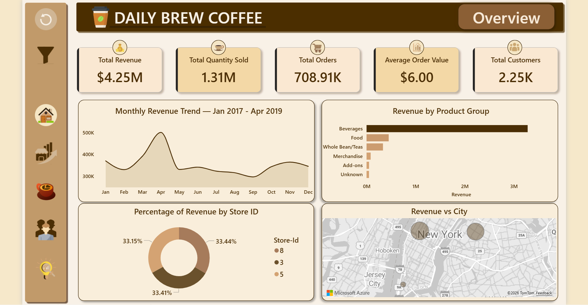
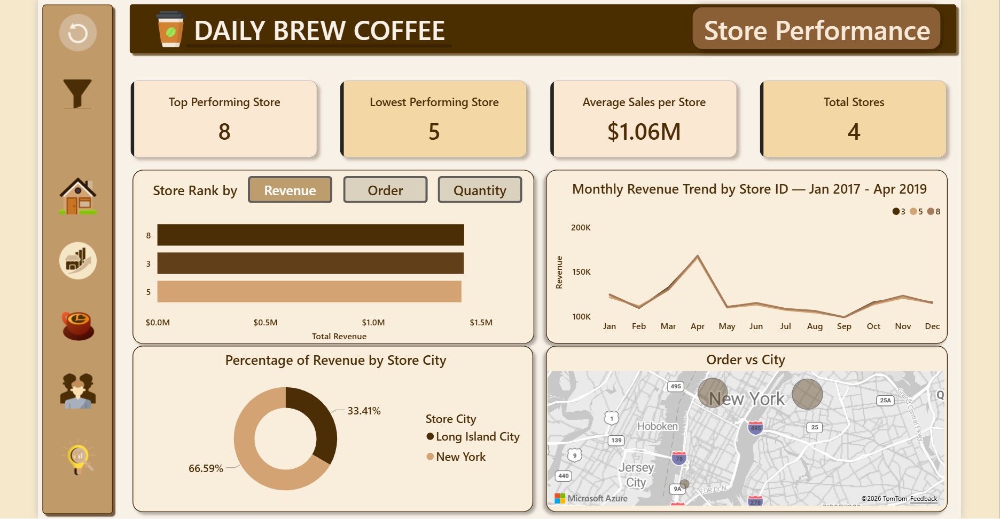
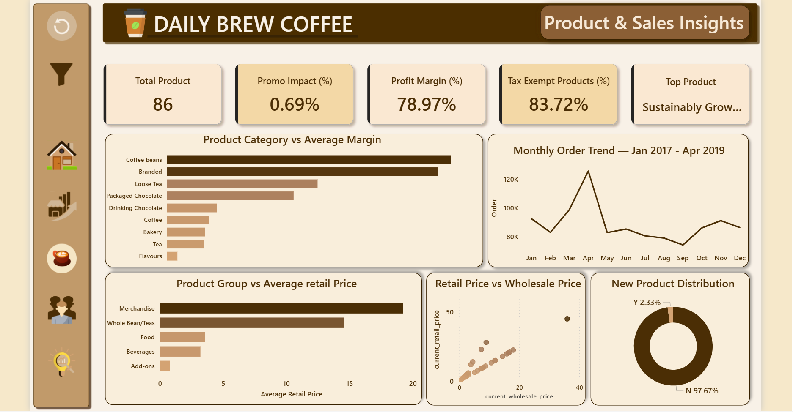
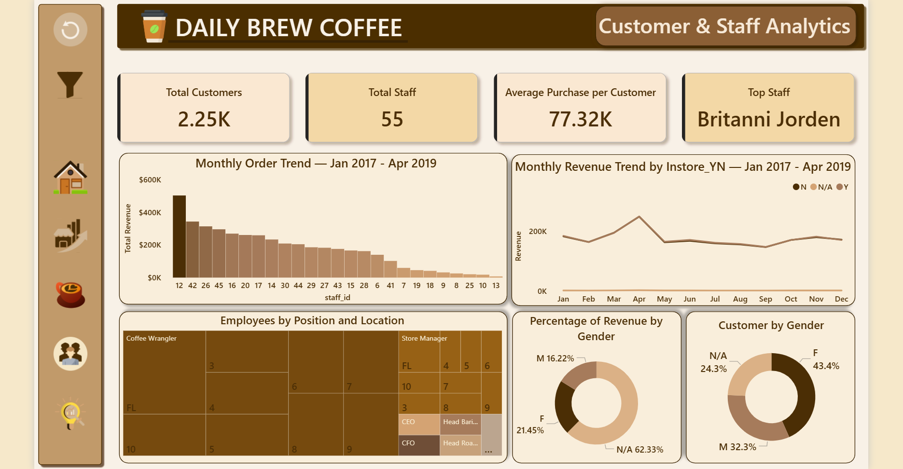
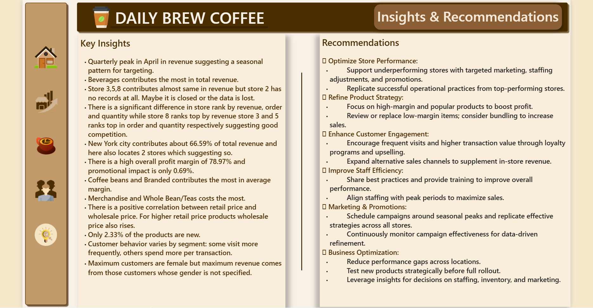

# Daily Brew Coffee — Power BI Business Intelligence Dashboard

This project presents a multi-page business intelligence dashboard built using Power BI to analyze sales performance, store operations, product insights, and customer behavior for a coffee retail business.

The dashboard transforms raw transactional data into interactive visual analytics to support data-driven business decisions.

---

## Dashboard Overview

This page summarizes overall business performance including total revenue, orders, customers, and monthly revenue trends.

---

## Store Performance

This section analyzes store-level performance using revenue rankings, store sales trends, and geographic distribution of orders.

---

## Product & Sales Insights

This page focuses on product categories, pricing relationships, product margins, and product-level sales performance.

---

## Customer & Staff Analytics

This section explores customer demographics, purchasing behavior, and staff performance metrics.

---

## Insights & Recommendations

The final page summarizes key insights derived from the analysis and suggests business recommendations.

---

## Key Metrics Tracked

The dashboard analyzes several key business indicators:

- Total Revenue
- Total Orders
- Average Order Value
- Total Customers
- Product Profit Margin
- Store Performance Rankings

---

## Tools Used

- Power BI
- Data Modeling
- DAX Measures
- Interactive Dashboard Design

---

## Author

Md. Rabbiul Hasan Rakib  
Statistics & Data Science  
Jahangirnagar University
